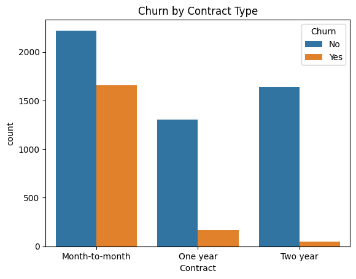
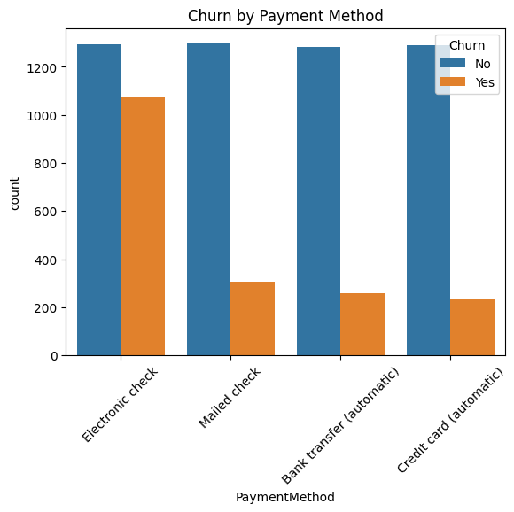
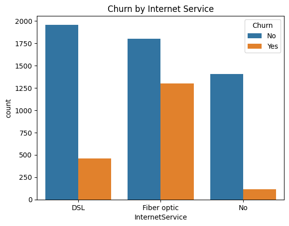

# 📊 Customer Churn Analysis — Data Analytics Portfolio Project

## 🔍 Business Problem

Customer retention is **5–7x cheaper** than acquiring new customers.  
Telecom companies lose millions in revenue due to customer churn.

This project answers:

- Who is likely to churn?
- Why are they leaving?
- Which customers are most valuable to retain?
- What retention strategies can reduce churn?

---

## 🗂️ Dataset

- Dataset: Telco Customer Churn Dataset
- Records: 7,043 customers
- Features: Demographics, services used, billing, tenure, contract type, and churn status

---

## 🛠️ Tools & Technologies Used

- **Python (Pandas, Matplotlib, Seaborn)**
- **SQL**
- **Jupyter Notebook**
- **Git & GitHub**
- **Data Cleaning & Feature Engineering**

---

## 🧹 Data Cleaning Steps

- Handled missing values in `TotalCharges`
- Converted data types
- Created new feature: **CustomerValue = MonthlyCharges × Tenure**
- Encoded categorical variables for analysis

---

## 📈 Exploratory Data Analysis (EDA)

Key analysis performed:

- Churn rate by gender, senior citizens, partners, dependents
- Churn by contract type and payment method
- Impact of internet services and tech support on churn
- Revenue impact of churned customers
- Customer segmentation based on value

---

### 📊 Churn by Contract Type

### 💳 Churn by Payment Method

### 🛠️ Churn by Services Used

## 💡 Key Insights

- Customers on **month-to-month contracts** churn the most
- Lack of **Tech Support** and **Online Security** increases churn probability
- Customers with **higher monthly charges** are more likely to churn
- High-value customers (long tenure + high monthly charges) represent major revenue loss when they churn

---

## 💰 Revenue Impact

Customers who churn have significantly lower lifetime value compared to retained customers.

This indicates the importance of identifying at-risk high-value customers early.

---

## 🎯 Retention Strategies

Based on analysis, the following strategies can reduce churn:

1. Promote long-term contracts with incentives
2. Offer free Tech Support / Security trials
3. Target high monthly charge customers with loyalty discounts
4. Proactive engagement for customers with low tenure

---

## 🧠 SQL Analysis

SQL queries were written to:

- Segment churned vs retained customers
- Calculate churn percentage by contract type
- Identify high-value customers
- Analyze service usage patterns

See: `sql_queries.sql`

---

## 📁 Project Structure

Customer-Churn-Analysis/
│
├── churn_analysis.ipynb
├── sql_queries.sql
├── README.md
│
├── data/
│   ├── WA_Fn-UseC_-Telco-Customer-Churn.csv
│   └── clean_churn_data.csv
│
├── images/
│   ├── churn_contract.png
│   ├── churn_payment_method.png
│   └── churn_services.png

---

## 🚀 How to Run This Project

1. Clone the repository
2. Open `churn_analysis.ipynb` in Jupyter Notebook
3. Run all cells

---

## ✅ Outcome

This project demonstrates:

- Real-world data cleaning
- Business-driven data analysis
- SQL + Python integration
- Translating data insights into business strategies

---

## 👩‍💻 Author

**Seema Jillella**  
Aspiring Data Analyst | Python | SQL | Data Visualization
